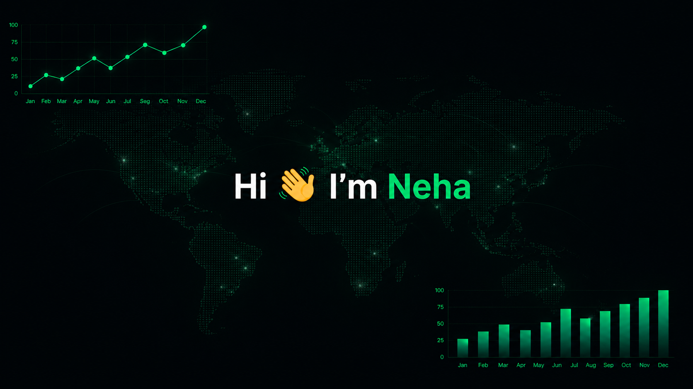

<!-- 
  ============================================================
  STEP 1 — YOUR BANNER IMAGE
  ============================================================
  - Upload your forest photo into this repo on GitHub
    (click "Add file" → "Upload files" when inside the repo)
  - Then replace  YOUR_IMAGE_NAME.jpg  below with your file name
  - Example: if you upload "forest.jpg" → write forest.jpg
  ============================================================
-->
  

 

### 🙋‍♀️ About Me

- 🔍 Explored data analytics through diverse projects using different tools, techniques and approaches. 
- 📊 Continuously expanding my knowledge and skillset while always being open to learning something new.
- 🔗 Looking to collaborate on data analysis and open-source analytics work!
- 💼 Seeking opportunities to contribute and grow professionally.

---

### 🌱 Beyond Data

- 🌍 Enjoy exploring new places and experiencing different cultures.
- 🤝 Value collaboration, communication, and building meaningful connections.
- 🌿 Appreciate spending time in nature.

---

### 🛠️ Tools & Tech

### 🧠 Relevant Coursework

`Statistical Analysis` · `Data Visualization` · `Regression` · `Time Series` · `Experimental Design` · `RAG` · `Artificial Intelligence` · `Simulations & Modelling` · `Machine Learning` · `Deep Learning` · `Multivariate Statistics`

---

### 📫 Connect With Me

<!-- Replace the links below with your actual URLs -->

